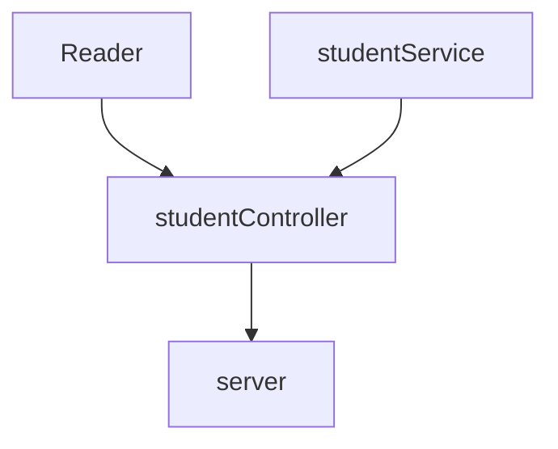

# Code Challenge. 
Code Challenge Week 4 "Cursos de Visual Thinking API". 

## Requeriments: 
1. Creating a endpoint to consult all students information. 

2. Creating a endpoint to consult all student's emails with `haveCertification` certification. 

3. Creting a endpoint to consult all students with `credits` greater than 500.

## Clone Repository. 
- Go [Code Challenge](https://github.com/JossPerezT/Code-Challenge-Cursos-de-Visual-Thinking-API) repository. 

- Click _code_

- Copy the URL: SSH or HTTP

- Go your terminal and run command `git clone <URL>`

- Done. We clone my repository.

## Getting Started
This proyect need dependencies Jest, Express, EsLint and Supertest. 
1. Run: `npm install` to create node_modules files. 

If don´t install it, run:
1. Jest: `npm install --save-dev jest`
2. Express: `npm install express --save`
3. Eslint: `npm install eslint --save-dev to install dependence and `npm init @eslint/config` to configure the rules.
4. Supertest: `npm install supertest --save-dev`

## Dependencies. 
- [Jest](http://jestjs.io/): Testing Framework to test my code. `Version 27.5.1`
- [Express](https://expressjs.com/): Web framework to creating API´s and http methods. `Version 4.18.1`
- [Supertest](https://www.npmjs.com/package/supertest): Used it to run testing with a http method server. `Version 6.2.3`
- [Eslint](https://eslint.org/): Used it to find and fix syntax errors and standirse code. `Version 8.15.0`

## Design 

I separated responsibilities: 
- Service: gives functionality to projects: get all students, get all emails and get all students with credits greater than 500. 
- Reader:  gives auxiliary class to read JSON files. 
- Controller: is  a connection with the server. 

## Endpoint 
| Endpoint | Request | Response  | Example
|---|---|---|---|
| `localhost:3000/` | `localhost:3000/` |You should get 'Welcome to Visual Thinking API'||
| `localhost:3000/students/` | `localhost:3000/students` | You should get a list of all students information||
| `localhost:3000/students/emails/` | `localhost:3000/students/emails` | You should get all studients emails with certification||
| `localhost:3000/students/credits/` | `localhost:3000/students/credits` | You should get all students information with credits greater than 500||

## Run project. 
- Run `npm run server`in  command line. 
  -  
- The server should be ready, enter endpoints in your browser and will see the API.
- Run tests `npm test`

## EsLint 
EsLint help us to find and finx syntax error and gives a style guide about standirse code. Here use [Airbnb JavaScript Style Guide](https://github.com/airbnb/javascript) `Version 15.0.0`
- Run `npm run linter` to find syntax errors. 
- Run `npm run linter --fix`to fix all syntax errors automatically. 
